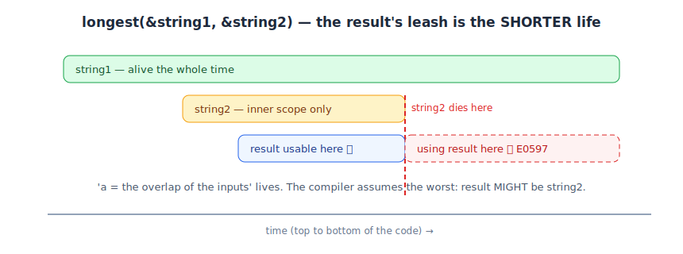

# 07 — Lifetime Annotations (the longest function)

*Rust Book, 10.3. Builds on: 06 — Why Lifetimes Exist.*

## The question the compiler can't answer alone

```rust
fn longest(x: &str, y: &str) -> &str {          // ❌ won't compile
    if x.len() > y.len() { x } else { y }
}
```

```
error[E0106]: missing lifetime specifier — expected named lifetime parameter
```

The returned reference is either `x` or `y` — decided *at runtime*. So at compile time, the borrow checker can't know how long the result is valid. It needs you to state the relationship:

```rust
fn longest<'a>(x: &'a str, y: &'a str) -> &'a str {
    if x.len() > y.len() { x } else { y }
}
```

## How to read `'a` (say it out loud)

> "There is some stretch of code `'a`. Both inputs live *at least* that long. The returned reference is only guaranteed valid *within* that stretch."

In practice: **the result lives as long as the shorter-lived of the two inputs.** Annotations don't *extend* anything — they *describe* the constraint so the checker can enforce it.



## Watch it work

```rust
let string1 = String::from("long string is long");
let result;
{
    let string2 = String::from("xyz");
    result = longest(string1.as_str(), string2.as_str());
    println!("{result}");     // ✅ inside — both inputs alive
}
// println!("{result}");      // ❌ outside — string2 is dead, and result MIGHT be it
```

The compiler rejects the last line even though `result` *happens* to point at `string1` — it must assume the worst case. Safety over cleverness.

## Structs holding references

A struct that stores a reference needs the same honesty:

```rust
struct ImportantExcerpt<'a> {
    part: &'a str,            // "this struct cannot outlive what `part` points at"
}
```

## Fine print

- Only *relationships between references* need annotations — returning an owned `String` instead would erase the problem entirely (a legitimate design choice).
- A returned reference must be tied to an *input*; returning a reference to a local is a dangle, and no annotation can bless it.

**One-liner:** `'a` doesn't change how long anything lives — it tells the compiler which input the output's leash is tied to.

🔨 **Lab:** [labs/lab-06-09-lifetimes](labs/lab-06-09-lifetimes/) *(covers notes 06–09)*
