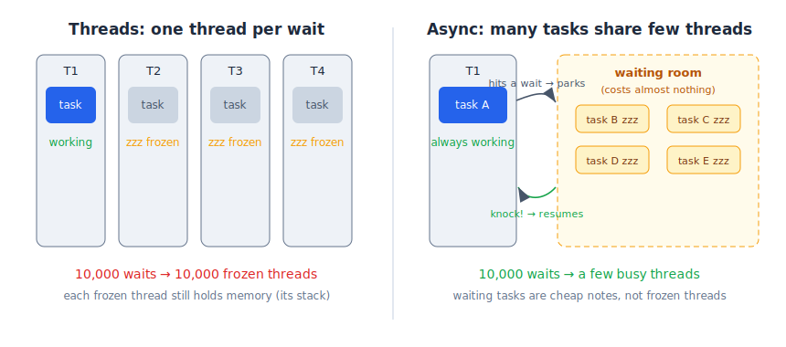

# 01 — Why Async Exists

*Rust Book, Ch. 17 (Async Fundamentals). Prerequisite: threads (Ch. 16).*

## Two kinds of "slow"

- **CPU-bound** — busy *computing* (video compression, hashing). The CPU works the whole time.
- **IO-bound** — busy *waiting* (network reply, file read, timer). The CPU does *nothing*.

## The story

An IO-bound program on a plain thread:

> **Code:** "Requesting data from the network..."
> **Thread:** *stands completely frozen, holding its full stack of memory, doing zero work, until the reply arrives.*

One frozen thread is fine. 100,000 frozen threads — one per connection — and you're out of memory just to hold people who are all doing *nothing*.

Async changes the conversation:

> **Code:** "I'm stuck on a network call. Go do something else — when my data arrives, I'll knock, and you push me further."
> **Thread:** "Deal." *(walks off and runs other tasks)*

That "knock" is real — Rust calls it a **waker**, and you'll meet it later in this chapter.

## Rule of thumb

- Work that **computes** → threads.
- Work that **waits** → async.

**One-liner:** Async = many waiting tasks sharing few threads.

🔨 **Lab:** [labs/lab-01-03-lazy-proof](labs/lab-01-03-lazy-proof/) *(covers notes 01–03)*
