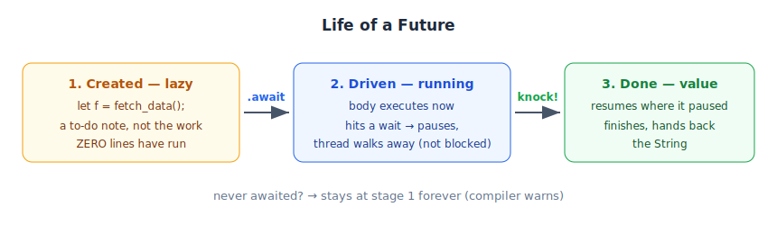

# 02 — What a Future Is (async fn and .await)

*Rust Book, Ch. 17. Builds on: 01 — Why Async Exists.*

## The rule that surprises everyone

```rust
async fn fetch_data() -> String { /* network call */ }
```

Calling `fetch_data()` runs **nothing**. It returns a **Future** — a *to-do note*, not the completed work. The order receipt, not the food.

## The story

> **You:** `let future = fetch_data();`
> **Future:** "Noted. I'm a plan for fetching data. Not lifting a finger until someone drives me."
> **You:** `future.await`
> **Future:** "NOW I run. You pause right here — but I won't freeze your thread. If I hit a wait, the thread leaves; I'll knock when I have your `String`."



## The two facts

1. **Futures are lazy.** Never awaited → never runs. (The compiler warns you.)
2. **`.await` is the driver.** Run now, pause here — *without* blocking the thread.

```rust
let future = fetch_data(); // nothing happened yet
let data = future.await;   // NOW it runs; we wait here
```

## Fine print

- `async fn ... -> String` secretly returns `impl Future<Output = String>`.
- `.await` only works inside `async` code. Who drives the *outermost* future? A **runtime** — next note.

**One-liner:** An async fn returns a plan; `.await` executes the plan.

🔨 **Lab:** [labs/lab-01-03-lazy-proof](labs/lab-01-03-lazy-proof/) *(covers notes 01–03)*
