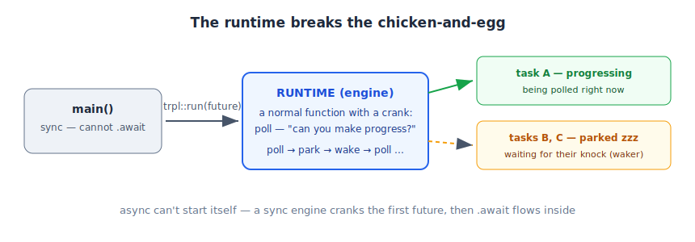

# 03 — The Runtime (who drives futures)

*Rust Book, Ch. 17. Builds on: 02 — What a Future Is.*

## The chicken-and-egg problem

- To run a future, you `.await` it.
- But `.await` is only allowed **inside** an `async fn`.
- And an `async fn` is itself just a future that *also* needs someone to `.await` it. Who awaits that one? Another async fn? Then who awaits **that**?

It never ends: async code can only be driven by more async code — nobody can go first. And `main` is a normal function; it can't `.await` at all.

> **main:** "I'm sync, I can't await you."
> **future:** "And I can't start myself."
> **runtime:** "Give it here. I have a crank."

The **runtime** (also called *executor*) breaks the loop: it's a *normal* function that drives the first future without `.await`, using a lower-level hand-crank (`poll`). Once the first future spins, everything inside it flows through ordinary `.await`s.



## The story

A restaurant holds a stack of order receipts (futures). Receipts don't cook themselves — a **manager** keeps the stack, checks which order can make progress ("fries ready? push that order forward"), and sets aside orders still waiting on the oven.

In the machine:

> **Runtime:** "Give me your top-level future. I'll poll it: 'can you make progress?' If it says 'still waiting,' I park it and run another task. When its knock (waker) comes, I resume it."

## The twist

**Rust ships async syntax, but no runtime.** You bring your own — the ecosystem standard is **Tokio**. The Rust Book uses its `trpl` crate: a thin wrapper over Tokio to skip setup ceremony.

```rust
fn main() {
    trpl::run(async {          // start the engine, drive this future to completion
        let data = fetch_data().await;
        println!("{data}");
    });
}
```

## Fine print

- Plain Rust has no `async fn main` — `main` must synchronously hand a future to a runtime (`trpl::run`, or Tokio's `#[tokio::main]` attribute, which generates exactly this wrapping).
- "Poll it, park it, wake on knock" is literally the `Future` trait's mechanics (`poll` + `Waker`) — formalized later in the chapter.

**One-liner:** Futures are plans; the runtime is the engine that runs the plans.

🔨 **Lab:** [labs/lab-01-03-lazy-proof](labs/lab-01-03-lazy-proof/) *(covers notes 01–03)*
