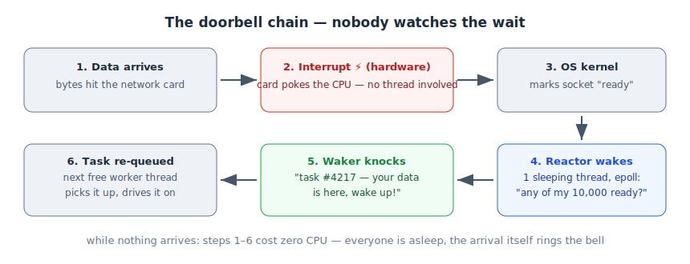

# 04 — Who Watches the Wait?

*Rust Book, Ch. 17 (background deep-dive). Builds on: 03 — The Runtime.*

## The question

At an `.await` on a network call, the thread moves on to other tasks. So... who is monitoring the request? Who knocks when the data arrives? It seems like there's no one left to do the job.

## The answer: nobody watches — there's a doorbell

Real world: you order a package. You don't stand at the window watching the street — you live your life, and the **doorbell** rings when it arrives. No one "monitored." The arrival itself triggers the ring.

## The machine's doorbell (four layers)

1. **Network card (hardware).** When data physically arrives, the card fires an **interrupt** — an electrical poke to the CPU. Not a thread. Costs zero work while waiting.
2. **OS kernel.** Catches the interrupt, marks the socket: "ready."
3. **Reactor (part of the runtime).** The runtime asks the OS *one* question: "of these 10,000 sockets, wake me when ANY becomes ready" (a single blocking call — `epoll` on Linux, `kqueue` on macOS, IOCP on Windows).
   *Yes, a thread is involved here — but only one, for ALL waits, and it's asleep while it waits (the OS suspends it; the interrupt wakes it — it never loops asking "ready yet?"). Without async: 10,000 waits = 10,000 blocked threads. With async: 10,000 waits = 1 sleeping thread. The cost of waiting no longer scales with the number of waits — one sleeping doorman for the whole building, not one guard per door.*
4. **Waker.** When the OS answers "socket #4217 ready," the reactor calls that task's **waker** — the knock. The task goes back into the runtime's queue; the next free thread picks it up and drives it forward.

## The chain

> data arrives → hardware interrupt → OS marks ready → reactor hears it → waker knocks → task re-queued

## Why this matters

**Waiting is free at the hardware level.** Nobody spins asking "done yet? done yet?" — the arrival itself triggers the chain. That's why one runtime with a handful of threads can hold 100,000 open connections.

**One-liner:** No one watches the wait — the arrival rings the doorbell.
