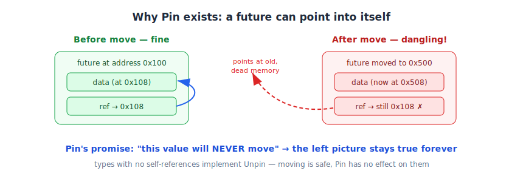

# 08 — Under the Hood: the Future Trait, poll, and Pin

*Rust Book, Ch. 17.5. Builds on: 03 — The Runtime, 04 — Who Watches the Wait.*

## The Future trait, finally

```rust
pub trait Future {
    type Output;
    fn poll(self: Pin<&mut Self>, cx: &mut Context<'_>) -> Poll<Self::Output>;
}

pub enum Poll<T> { Ready(T), Pending }
```

`.await` compiles into roughly: *poll it — if `Ready(v)`, take the value; if `Pending`, park and let the waker (inside `cx`) knock later.* This is the hand-crank from note 03 and the doorbell from note 04, now with official names.

## What an async block really becomes

The compiler rewrites an `async` block into a **state machine**: one state per `.await`, storing the local variables that must survive across that pause. Polling advances the machine one state at a time.

## Pin — why it exists

That state machine may contain a **reference to one of its own fields** (any local you borrow across an `.await`). Now imagine moving the machine to a new memory address: the stored self-reference still points at the **old** address. Dangling pointer — the exact thing Rust exists to prevent.



The fix isn't to forbid such futures; it's to **forbid moving them**:

- `Pin<&mut T>` / `Pin<Box<T>>` is a wrapper whose promise is: *the value inside will never move again.* Nail it to the floor, and self-references stay valid forever.
- Most types have no self-references and don't care about moving — they implement **`Unpin`** (automatic), and Pin has zero effect on them.
- In practice you meet Pin in **error messages** (e.g., `join_all` requires pinned futures). Fix: `Box::pin(fut)` or the `std::pin::pin!` macro.

## Streams' trait, for symmetry

```rust
fn poll_next(...) -> Poll<Option<Item>>
```

`Poll` from Future + `Option` from Iterator — a stream really is the marriage of the two (note 07).

## Fine print

- You will almost never write `poll` or touch `Waker` by hand — runtimes and combinators do it. This note is for *trusting* the machinery, not reimplementing it.

**One-liner:** `.await` = a polite poll loop; Pin = nailing a self-referencing future to one spot so its inner pointers never dangle.
